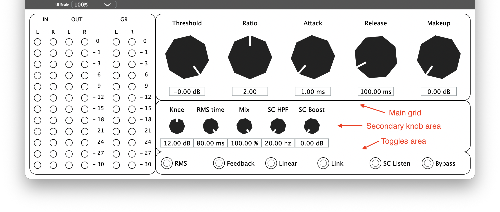

# NtPlugin

A framework for fast and easy audio plugin development. Includes a number of
plugins that can be used as is or as examples.

## Target audience

The target audience of this project fall in two groups. One is musicians and
producers who want high quality plugins free of charge and with a consistent UI
look and feel. The other is hobbyists, students and professionals who needs to
try out an idea quickly, without having to build a custom GUI for it. Users will
be able to focus on the algorithms and not all the details of using JUCE or
another framework.

## Features

- Write audio plugins in plain C++ without the need for knowledge of the JUCE
  framework.
- Automatic layout of UI including metering and UI scaling. Just list your
parametes, and the framework takes care of the rest.
<!-- TODO: - Oversampling available by default. -->
- Possibility for wrapping plugins for other targets.
  <!-- - Or just download the releases and start mixing. -->
  <!-- TODO: relaeses. -->

### The UI

.

The autogenerated UI is devided into four sections. The **main grid** displays
the user defined knobs in the order they are defined. The grid is automatically
laid out for minimal empty space in the UI. Maximum rows and columns are user
customizable and defaults to 6 and 3. Only the main grid is not optional. The
remaining areas can be disabled by the user. The **secondary knobs** are for
fine control or less important parameters. They are a single row that clips if
it gets too long. The width of the UI can be set to accommodate more
controls.<!-- TODO: auto width of UI if secondary knobs are too many. --> The
**toggles area** is at the bottom of the UI for boolean paramters. To the left
is the **meters area**, which displays peak level. Both normal and inverted
(gain reduction) meters are available.

## Getting started

### Install needed software

- Install [git](https://git-scm.com/install).
- Install [Cmake](https://cmake.org/download). The brew-version does not work,
  so if you're on Mac, download it from the website.
- Install [Visual Studio](https://visualstudio.microsoft.com/downloads/)
  (Windows) or [XCode](https://developer.apple.com/xcode/) (Mac) or the
  [JUCE dependecies](https://github.com/juce-framework/JUCE/blob/master/docs/Linux%20Dependencies.md)
  (Linux). This includes adding the tools to PATH, which is mostly automatic on
  Mac and Linux. The new _PowerShell for VS_ Windows app also includes them.
- Git clone with `--recurse-submodules´ flag. This will add the JUCE framework
  to the download.

### Try it out

- To test the install, type

```sh
cmake -B build -S JuceWrapper -DNTFX_PLUGIN=gainExample
cmake --build build
```

in the terminal. This should build the simple gain knob example plugin.

## Usage

- Create your plugin as `plugins/[name of your plugin].h` in the project
  directory.
- Write a class that inherits from `NtFx::NtPlugin`. The name of your class must
  be the same as the file name.
- The base class requires you to implement the methods `processSample`,
  `updateCoeffs` and `reset`. `processSample` runs for every sample,
  `updateCoeffs` is called every time a parameter changes and `reset`
  (re)initializes the plugin and sets the samplerate. `reset` should always call
  `updateCoeffs`.
- The base class contains 3 empty vectors, that the user can add parameters to
  in the constructor of the plugin. `primaryKnobs` contains specifications for
  the main knobs, which are laid out in a grid automatically, `secondaryKnobs`
  can be used to add a single row of smaller knobs below main gird for fine
  tuning or utility controls. `toggles` contain the boolean parameters. The
  constructor should call `updateDefaults` before returning.
- Similarly, the base class contain a spec for the UI named `guiSpec`, which can
  be modified for customization of the UI.
- Use the following commands to configure and build your project:

```sh
cmake -B build -S JuceWrapper -DNTFX_PLUGIN=[name of your plugin]
cmake --build build
```

- Once the project is configured, only the build-command is needed for
  incremental builds.
- On Mac and Linux, the plugin is automatically installed on the system. Launch
  your DAW and test your plugin.

Have fun coding.

### Caveats

As with all code projects, there are secrets to know.

- If you want to make AXX plugins for Pro Tools, you need to get the AAX SDK
  from avid and put it in the JuceWrapper directory.
- Since Cmake for Mac doesn't have hashing support, plugin IDs are selected at
  random. This means that when ever Cmake is reconfigured, it's a new plugin and
  you'll need to reinsert it in the DAW.
- On windows, the system won't be able to install outputs, so the easiest way to
  test your plugin is to add
  `/path/to/repo/build/[your plugin]\_artefacts/Debug/VST3` to the list of VST
  search paths in your DAW, so you don't need to copy it to
  `C:\\Program Files\\Common Files\\VST3\\` for every build.

### Making it work with VsCode

All of these things are specific to JUCE and not the NtPlugin framework, and
they should work on and JUCE plugin project.

NOTE: VsCode on ARM Windows is an absolute mess. Not only does it not work, it
also breaks your tools some magical way. Debugging works, but don't try to use
Cmake.

- Install the Cmake extension.
- Add this to `.vscode/settings.json`:

```json
"cmake.configureArgs": [
    // Insert your plugin name. REMEMBER to update when switching plugins or
    // one plugin will overwrite another under a wrong name and you're fucked.
    "-DNTFX_PLUGIN=gainExample"
  ],
```

- Add thing to `.vscode/c_cpp_propertie.json`. The rest of the configuration
  depends on your OS and local setup, but is the same as any project:

```json
"configurations": [
    {
      "name": "JUCE",
      "includePath": [
        "${workspaceFolder}/lib",
        "${workspaceFolder}/plugins",
        "${workspaceFolder}/JuceWrapper",
        "${workspaceFolder}/JuceWrapper/JUCE/modules"
      ],
      // These don't have to be changed when switching plugins.
      // They are only there to keep intellisense happy.
      "defines": [
        "JucePlugin_Name=\"gainExample\"",
        "NTFX_PLUGIN=gainExample",
        "NTFX_PLUGIN_FILE=\"plugins/gainExample.h\""
      ],
    }
  ],
  "version": 4
```

- Add this to `.vscode/launch.json`:

```json
{
  "version": "0.2.0",
  "configurations": [
    {
      "name": "REAPER",
      "type": "lldb",
      // Or "cppvsgdb" on Windows or whatever your favorite debugger is.
      // lldb seems to work well on Mac.
      "cwd": "${workspaceFolder}",
      "request": "launch",
      "program": "/Applications/REAPER.app/Contents/MacOS/REAPER",
      // Or the path to your favorite DAW. Only tested against REAPER.
      // On Windows:
      "program": "C:\\Program Files\\REAPER (arm64)\\reaper.exe"
    }
  ]
}
```

- Now, you can hit cmd-shift-p and type `Cmake: Configure` followed by hitting
  F5 and the debugger should start.

## Collaborations

Collaborators are most welcome. Feel free to make bug reports, feature requests
and pull requests. If you manage to make a nice plugin, add wish to share with
the world, it can become part of the repo through a pull request. A wrapper for
the JUCE framework is available, but since plugins are written in
platform-agnostic code, targeting more platforms in the future is possible. If
anyone wishes to colaborate, adding a wrapper for eg. ESP32 or an ADI device
would be an option for a project.
