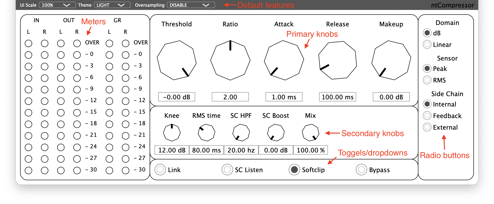

# NtPlugin

A framework for fast and easy audio plugin development. Includes a number of
plugins that can be used as is or as examples.

## Target audience

The target audience of this project fall in two groups. One is musicians and
producers who want high quality plugins free of charge and with a consistent UI
look and feel. The other is hobbyists, students and professionals who needs to
try out an idea quickly, without having to build a custom GUI for it. Users will
be able to focus on the algorithms and not all the details of using JUCE or
another framework.

## Features

- Write audio plugins in plain C++ without the need for knowledge of the JUCE
  framework.
- Automatic layout of UI including metering and UI scaling. Just list your
  parametes, and the framework takes care of the rest.
- Oversampling available by default.
- Possibility for wrapping plugins for other targets.
  <!-- - Or just download the releases and start mixing. -->
  <!-- TODO: relaeses. -->

### The UI



The autogenerated UI is devided into six sections. The **main grid** displays
the user defined primary knobs in the order they are defined. The grid is
automatically laid out for minimal empty space in the UI. Maximum rows and
columns are user customizable and defaults to 6 and 3. Only the main grid is not
optional. The remaining areas can be disabled by the user. The **secondary
knobs** are for fine control or less important parameters. The
**toggles/dropdowns area** is at the bottom of the UI for boolean paramters and
drop downs. To the left is the **meters area**, which displays peak and RMS
level. Both normal and inverted (gain reduction) meters are available. RMS is
only available for the first two meters, which are assumed to measure in- and
output. To the right, the **radio buttons area** displays all the sets of radio
buttons that the user defines. Finally, the **title bar** at the top contains
the default options such as colour theme, oversampling setting and UI scaling.
This can be disabled by the user, but the parameters are still there in the
background.

## Getting started

### Install needed software

- Install [git](https://git-scm.com/install).
- Install [Cmake](https://cmake.org/download).
- Install [Visual Studio](https://visualstudio.microsoft.com/downloads/)
  (Windows) or [XCode](https://developer.apple.com/xcode/) (Mac) or the
  [Linux dependecies](#linux-dependencies) (Linux).
- Git clone with `--recurse-submodules` flag. This will add the JUCE framework
  to the download along with other libraries.

#### Linux dependencies

Run the following command to install dependencies on Linux.

##### Ubuntu

```sh
sudo apt update
sudo apt install -y git cmake libasound2-dev libjack-jackd2-dev ladspa-sdk libcurl4-openssl-dev  libfreetype-dev libfontconfig1-dev libx11-dev libxcomposite-dev libxcursor-dev libxinerama-dev libxext-dev libxrandr-dev libxrender-dev libwebkit2gtk-4.1-dev libglu1-mesa-dev mesa-common-dev python3.12-venv
```

##### Fedora

```sh
sudo dnf update
sudo dnf install -y g++ git cmake alsa-lib-devel jack-audio-connection-kit-devel.aarch64 libcurl-devel freetype-devel libX11-devel libXcomposite-devel libXcursor-devel libXinerama-devel freeglut-devel gnutils-devel libstdc++-static ladspa-devel webkit2gtk4.0-devel.aarch64 gtk3-devel mesa-libGL-devel
```

### Try it out

- To test the install, type

```sh
cmake -B build -S JuceWrapper -DNTFX_PLUGIN=gainExample
cmake --build build
```

in the terminal. This should build and install the simple gain knob example
plugin.

## Installation from source

If you just want to install the included plugins, this can be done from source.
The included `build_install.sh` script will do this for Mac and Linux once the
[needed software](#install-needed-software) is installed. `build_install.bat` is
available for build on Windows. At the time of writing, it does not install
anything because of Windows security features. The easiest way to use the
plugins after this build is to add `[repo dir]\artifacts\VST3` to you DAW's
plugin search path. Alternatively, you can copy and paste the contents of that
folder to your plugin install folder.

## Usage

- Create your plugin as `plugins/[name of your plugin].h` in the project
  directory.
- Write a class that inherits from `NtFx::NtPlugin`. The name of your class must
  be the same as the file name.
- The base class requires you to implement the methods `process`, `update` and
  `reset`. `process` runs for every sample, `update` is called every time a
  parameter changes and `reset` (re)initializes the plugin and sets the
  samplerate. `reset` should always call `update`.
- The base class contains a number of empty vectors, that the user can add
  parameters to in the constructor of the plugin. `primaryKnobs` contains
  specifications for the main knobs, which are laid out in a grid automatically,
  `secondaryKnobs` can be used to add a single row of smaller knobs below main
  gird for fine tuning or utility controls. `toggles` contain the boolean
  parameters. The constructor should call `updateDefaults` before returning.
- Similarly, the base class contain a spec for the UI named `uiSpec`, which can
  be modified for customization of the UI.
- Use the following commands to configure and build your project:

```sh
cmake -B build -S JuceWrapper -DNTFX_PLUGIN=[name of your plugin]
cmake --build build
```

- Once the project is configured, only the build-command is needed for
  incremental builds.
- On Mac and Linux, the plugin is automatically installed on the system. Launch
  your DAW and test your plugin.

Have fun coding.

### Caveats

As with all code projects, there are secrets to know.

- If you want to make AXX plugins for Pro Tools, you need to get the AAX SDK
  from avid and put it in the JuceWrapper directory.
- Plugin IDs are selected at random. This means that when ever Cmake is
  reconfigured, it's a new plugin and you'll need to reinsert the plugin in the
  host/DAW. If you need the plugin to have the same ID after reconfiguration,
  you can add it manually by adding `-DNTFX_ID=[Original ID]` to the configure
  command.
- On windows, the system won't be able to install outputs, so the easiest way to
  test your plugin is to add
  `/path/to/repo/build/[your plugin]\_artefacts/Debug/VST3` to the list of VST
  search paths in your DAW, so you don't need to copy it to
  `C:\\Program Files\\Common Files\\VST3\\` for every build.

### Making it work with VsCode

All of these things are specific to JUCE and not the NtPlugin framework, and
they should work on and JUCE plugin project.

NOTE: VsCode on ARM Windows is an absolute mess. Not only does it not work, it
also breaks your tools some magical way. Debugging works, but don't try to use
Cmake.

- Install the Cmake extension.
- Add this to `.vscode/settings.json`:

```json
"cmake.configureArgs": [
    // Insert your plugin name. REMEMBER to update when switching plugins or
    // one plugin will overwrite another under a wrong name and you're fucked.
    "-DNTFX_PLUGIN=gainExample"
  ],
```

- Add thing to `.vscode/c_cpp_propertie.json`. The rest of the configuration
  depends on your OS and local setup, but is the same as any project:

```json
"configurations": [
    {
      "name": "JUCE",
      "includePath": [
        "${workspaceFolder}/lib",
        "${workspaceFolder}/plugins",
        "${workspaceFolder}/JuceWrapper",
        "${workspaceFolder}/JuceWrapper/JUCE/modules"
      ],
      // These don't have to be changed when switching plugins.
      // They are only there to keep intellisense happy.
      "defines": [
        "JucePlugin_Name=\"gainExample\"",
        "NTFX_PLUGIN=gainExample",
        "NTFX_PLUGIN_FILE=\"plugins/gainExample.h\""
      ],
    }
  ],
  "version": 4
```

- Add this to `.vscode/launch.json`:

```json
{
  "version": "0.2.0",
  "configurations": [
    {
      "name": "REAPER",
      "type": "lldb",
      // Or "cppvsgdb" on Windows or whatever your favorite debugger is.
      // lldb seems to work well on Mac.
      "cwd": "${workspaceFolder}",
      "request": "launch",
      "program": "/Applications/REAPER.app/Contents/MacOS/REAPER",
      // Or the path to your favorite DAW. Tested to work against REAPER. Pro
      // Tools not so much.
      // On Windows:
      "program": "C:\\Program Files\\REAPER (arm64)\\reaper.exe"
    }
  ]
}
```

- Now, you can hit cmd-shift-p and type `Cmake: Configure` followed by hitting
  F5 and the debugger should start.

##

## Collaborations

Collaborators are most welcome. Feel free to make bug reports, feature requests
and pull requests. If you manage to make a nice plugin, add wish to share with
the world, it can become part of the repo through a pull request. A wrapper for
the JUCE framework is available, but since plugins are written in
platform-agnostic code, targeting more platforms in the future is possible. If
anyone wishes to colaborate, adding a wrapper for eg. ESP32 or an ADI device
would be an option for a project.

## Testing your plugin

The `testWrapper` can be used to test plugins. The individual tests are stored
in `test` and are inidvidual C++ programs. A Python script named `test.py` is
used to run the tests. It will generate test input files, build the test
program, run it and plot the results. Plots are placed in `testWrapper/img`. If
the results are accepted, the script can approve them so that the test will
succeed on next run. Type `python testWrapper/test.py -h` for more information.

### Setting it up

First, we need the normal python envirement stuff:

```sh
python3 -m venv .venv
. ./.venv/bin/activate
pip install -r requirements.txt
```

Now run the existing tests:

```sh
python testWrapper/test.py run
```

This should run all existing tests, which should all succeed. `testWrapper/img`
should now contain a number of plots.

### Add your own test

In order to test a plugin you must create a file named `[plugin name]_test.cpp`,
include `lib/ComponentTest.h` and implement a main function, where you
instantiate you plugin, make some settings, and add the object to the test class
using `NTFX_ADD_TEST`. Then you retrun `runAllTests()`. Example:

```c++
#include "lib/ComponentTest.h"
#include "plugins/[your plugin].h"
NTFX_TEST_BEGIN // Macro to instantiate statics.

int main() { // Make a main function.
  [plugin name]<float> plug; // Instantiate plugin.
  plug.[some variable] = 2; // Make setting you wanna test.
  NTFX_ADD_TEST(plug, "impulse") // Add test to testWrapper framework.
  return NTFX_RUN_TESTS(); // Run all test tests.
}
```

`NTFX_ADD_TEST` takes a string argument that selects the stimulus to test
against. The options are `"impulse"`, `"syncSweep"`, `"linearSweep"` and
`"dynamic"`. Different plots are made based on the selected stimulus.

Save as `test/[plugin name]_test.cpp` and run

```sh
python testWrapper/test.py run [plugin name]
```

Alternativly, the path of the test cpp file can be used as argument.

This should generate plots of frequency and phase response (`"impulse"`),
spectrogram (`"linearSweep"`) and dynamic response using a stimulus of a 10 kHz
sine stepping between -12 dB and 0 dB level (`"dynamic"`). `"syncSweep"` does
not generate a plot at the time of writing. <!--TODO: Harmonic analysis.--> Both
left and right channels are displayed in all plots to make differences or
interactions visible. If the plots are good and the plugin is seen as passing
test, the results are approved with the command:

```sh
python testWrapper/test.py approve [test object names]
```

Note that the argument is not the name of the class, but the name of the object
instance in the test program. This is so some tests can be approved, while
others may not.

### Test with Pluginval

If you want to use pluginval you will need to do the following:

1. Make sure that set your cmake configuration to either Debug or Release.
2. That you set your preferred test strictness ind the file
   `JuceWrapper/tests/CMakeLists.txt`

The difference in strictness levels can be read inside the folder
`JuceWrapper/pluginval/README.md`, but by default it is set to 10, which will
test everything on the plugin for both AU and VST. You are able to add another
test in `JuceWrapper/tests/CMakeLists.txt`, if you were to make a plugin as
Standalone.

Once you have set the cmake configuration to Debug in VSC, and called:

```sh
cmake --build build
```

You can then do the following commands to call the pluginval test in order to
validate your plugins:

```sh
ctest --test-dir build
```

After calling `ctest` it will then start the validation of your plugin, and this
will then prompt in the terminal:

```sh
    Start 1: ValidatePluginAU
1/2 Test #1: ValidatePluginAU .................   Passed   19.66 sec
    Start 2: ValidatePluginVST3
2/2 Test #2: ValidatePluginVST3 ...............   Passed   17.05 sec

100% tests passed, 0 tests failed out of 2
```

## The NTfx library

The `lib` directory contains a library with a number of audio components, that
can be used for plugins. This is not dependant on any JUCE code, and only uses
the GCEM library for comiletime math. This ensures that the various features in
the library can be used in any wrapper that might get added to this framework in
the future. All the components in the library are templates and takes
`typename signal_t` as template paramters. This is so that we can swap the
underlying signal datatype if need be. We might want to implement a fractional
datatype in the future for use on platforms without an FPU, or just switch to
double precision for JUCE plugins.

### signal_t

All classes and free functions in the library are templates of `signal_t`, which
is the main signal datatype. At the time of writing, this always resolves to a
float, but it is a template parameter in order to change that at a later point
without having to touch all the code.

### The Stereo class

The Stereo class wraps two `signal_t` values in a single object and allows the
user to write the dsp code once for both channels.

### The Component class

The `NtFx::Component` class sits at the heart of the framework. This is not to
be confused with the `juce::Component` class, which is for UI components. It is
a true virtual base class, which enforces the interface for audio components in
the system. All stateful audio components in the library inherits this class,
including the `NtFx::NtPlugin` class, with either `signal_t` or
`Stereo<signal_t>` as template parameter denoting whether the component process
stereo or mono signals.

As stated [earlier](#usage), `NtFx::Component` has the following true virtual
methods. These must be implemented by all components in order to adhere to the
interface.

- `reset` Is to be called in the reset method of the plugin in order to
  propagate the sample rate and to where it's needed and empty any buffers
  and/or filter state.

- `update` Should be called if a component is affected by any parameters, in the
  update method of the plugin in order to update the filter coefficients this.
  If not, reset should be enough.

- `process` Processes the signal pr sample and should be called in the process
  method of the plugin.

The only member of the `Component` class is `float fs`, which is the oversampled
(high) sample rate.

<!--TODO: Anything else to say? -->

### The Plugin class

Each plugin design is controlled by settings in `uiSpec` and a number of
vectors, which are all members inherited from the NtPlugin class. Most of the
vectors are empty, and can be populated in order to add features to the UI.

#### UI Specification

The member `uiSpec` of `NtPlugin` contains a number of settings that can be set
by the user in the constructor for the plugin. This is where the user sets
things like window width, number of rows and columns and default sizes of
emelments in the UI. Some sizes are dynamic and use the set size as a max.

#### Parameters

UI elemments are added by pushing objects to the vectors that the user plugin
enhirets from the `NtPlugin` base plugin. The available vectors are:

- `primaryKnobs` contains the big knobs to be rendered in the main grid of the
  plugin. These are laid out on a grid automatically in the order they are
  defined. Adding an empty knob to `primaryKnob` like this:
  `this->primaryKnobs.push_back({});` leaves an empty space in the grid, in
  order to place the knobs where they are wanted. `uiSpec.maxRows` and
  `uiSpec.maxColumns` can be used to control the number of rows and columns.
  `p_val` of primary knobs must point to a `signal_t` value. If not, the
  parameter is seen as a dummy parameter.
- `secondaryKnobs` are placed below the main grid on a single row, that clips if
  it gets too long. The width of the UI can be set to accommodate more controls
  if needed. `p_val` of secondary knobs must point to a `signal_t` value. If
  not, the parameter is seen as a dummy parameter.
  <!-- TODO: auto width of UI if secondary knobs are too many. -->
- `toggles`
- `dropdowns` are placed to the left of toggles in the bottom row. The field
  `options` can be used to name the available options. `p_val` of dropdowns must
  point to an `int` value.
- `radioButtons` are placed in an area to the right of the main grid below each
  other in the order they are defined. They have the same underlying datatype as
  dropdowns and thus share the same members. Valued is an `int`.
- `toggleSets` is a vector of toggles grouped together in with a name. These are
  placed in the right side column along with the radio buttons and look the
  same. Only difference is that more than one on no toggle can be enabled at any
  one time. Stored as i bunch of `bool`s.
- `meters` are placed to the left. By default, an input and an output meter is
  available. More meters can be added using `push_back` and if no meters are
  wanted, they be deleted using the `clear`-method in the `std::vector` class.

Knobs can be added to the vectors `primaryKnobs` or `secondaryKnobs` like this:

```cpp
this->primaryKnobs.push_back({
  .p_val  = &this->mix_percent,
  .name   = "Mix",
  .suffix = " %",
  .minVal = 0.0,
  .maxVal = 100.0,
});
```

The remaining parameters types follow a similar patterns with a pointer to a
value, a name and some members specific to the type of parameter.

- `p_val` is a pointer to the value for the paramter, which should be a member
  of the plugin. Type must be `signal_t` for knobs, `bool` for toggles and `int`
  for dropdowns and radiobuttons.
- `name` is the display name, used as an identifier for DAW.
- `suffix` is added at the end of the text box for knobs.
- Dropdowns and radiobuttons have `options`, which is a vector if strings for
  the options to be displayed in the UI.

#### Side chain input

The side chain input is a mono input, which is updated for each sample at the
base sample rate and stored as the member `xSc` in the `NtPlugin` bae class.
This can the be used in the `process` method of the user plugin.

#### Tempo

`tempo` is another member of the `NtPlugin` base class that can be used for
coefficient calculation in the user plugin. It is updated per buffer if the host
supports it. If not, the tempo is 0, so the user should always check it before
using it.

<!-- ### UiSpec

TODO: Explain lib. -->

### The Glider class

Under some circumstances, changing parameters will cause clicks and pops in
audio output. In order to mitigate this, gLiders can be user to glide changes in
parameters into place slowly. The value facing the UI side of the plugin is
called `ui` and this should be set when the paramter changes, and the processing
facing value is named `pr`. This is what you use in the processing code. Both
linear and exponential gliders are available, and both follow the same pattern.
The exponential glider is asymptotic and reaches 90% of the target value as the
glide time expires, whereas the linear glider will reach the target exactly when
the time expires. The `Glider` class does follow the `Component` interface,
since `process` doesn't take an input and there is no `reset` method. Instead is
sample rate and the main setting, the glide time, set in the call to update.
`Glider::process` should only be called once per call to `process` in the user
plugin. The `ntTapeEcho` plugin in `plugins` contains an example of usage.

### The FirstOrder class

The `FirstOrder` class enhirets the `Component` class and thus follows that
pattern. It delivers a first order high filter and low pass filters, with and
without zero at the Nyquist frequency. The version with a zero at the Nyquist
frequency performs better in the high frequencies but the one without sums
perfectly when the filter is used for crossovers. The shape of first order
filters is set as a template parameter and thus is fixed at runtime.

### The Biquad class

Second order filters are encapsuled in the `Biquad` namespace. Both five and six
coefficient versions are available along with coefficient calculation for both.
An `EqBand` class pairs two five-coefficient biquads for left and right channel
with settings and can be used to add second order filters to a plugin. The
`Shape` enum holds the possible shapes and `none` can be used to bypass the
filter without branching if needed.

### The PeakSensor class

The peak sensor can be used to detect the peak level of a signal with a user
controllable release. This is used for dynamics side chains and peak level
meters.

<!-- TODO: Add Peak sensor with hold for nicer meters and look ahead
compressors. -->

### The RmsSensor class

Rms sensor with variable averaging time in milliseconds. Used for RMS dynamics
and metering.

### The SampleRateConverter class

The sample rate converter is a part of the plugin by default and the user
doesn't need to do anything in order to utilize it. It's a syncornios converter
that takes a reference to an `NtPlugin`, who's `process`-method will be called
per sample at the upsampled rate.

<!-- TODO: Add switch to disable SRC, ideally at compile time. -->

### SideChain

The `SideChain` namespace contains a number of compressor side chains, including
peak- and RMS-sensing in dB and linear domains.

<!--TODO: Explain lib. -->

### SoftClip

Since `SoftClip` does not hold state, it's not class. Classes are for storing
state, not for wrapping functions in a namespace (Java, I'm looking at you!).
The coefficients are calculated compile time and used in free functions for
third, fifth and seventh order soft clipping.

### Transformer

The `Transformer` class is an experiment to make a simplified transformer model.
It's only modelling the low frequency part of the transformer behavior.
